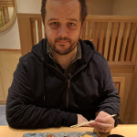
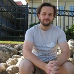
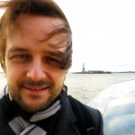
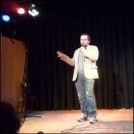
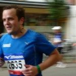

## Who Am I

I spent a decade (2003-2013) working in theoretical astrophysics and high performance computing, as a PhD candidate in Durham, England and then as a postdoc in Leiden, The Netherlands and finally in Chicago. Somewhere along the way I realized that I loved the computing more than the actual astrophysics and made the decision to move into industry and work on new and exciting areas. I am currently a hands-on CTO, who loves building teams and building siftware. I work at [Packback](https://www.packback.co).  Some of my personal projects are available on my blog.

## Work History

  1. I was data engineer, engineering manager, and then director of engineering at Narrative Science, where as director of engineering I ran the DevOps, IT, Security, and Engineering Customer Support teams.
  2. I was a computational astrophysicist at The University of Chicago and an associate fellow at the Kavli Institute for Cosmological Physics (2011-2013), where I worked on cosmic rays and black holes with Andrey Kravtsov and Nick Gnedin, and fueled my love of science communication by volunteering in the Adler planetarium.
  3. I was a postdoctoral researcher at Leiden Observatory (2007-2011), where I worked mainly with Joop Schaye on (among other things) overwhelmingly large simulations of galaxy formation, metal enrichment of the intergalactic medium and the co-evolution of the black hole and galaxy populations. See my research page for further details.
  4. I obtained my PhD on numerical modeling of the interstellar medium at Durham University (2003-2007) under the supervision of Tom Theuns. My PhD thesis is titled 'Simulating Molecular Cloud Regulated Star Formation in Galaxies'.
  5. My undergraduate education occured Nottingham University (1999-2003) where I achieved a 1st class MSci. (Hons) in Physics with Astronomy, and had a lot of fun.

## What Do I Look Like?

<figure class="third">
  
  
  
  
  
  
<figcaption>From top-left to bottom-right: Tokyo, Nov 2016; Florida, Nov. 2012; New York, Dec. 2010; Amsterdam, Jun. 2011; Amsterdam, Aug. 2009; Nottingham Sep. 1982</figcaption>
</figure>
