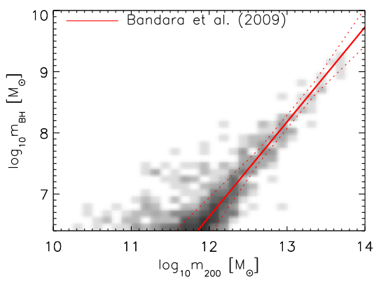
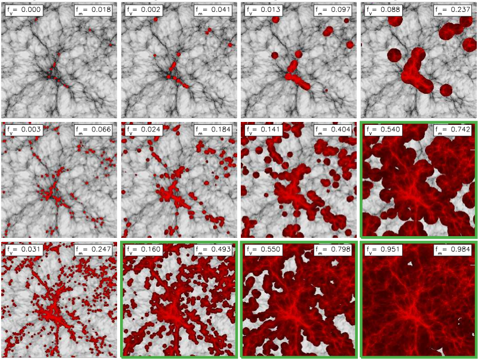
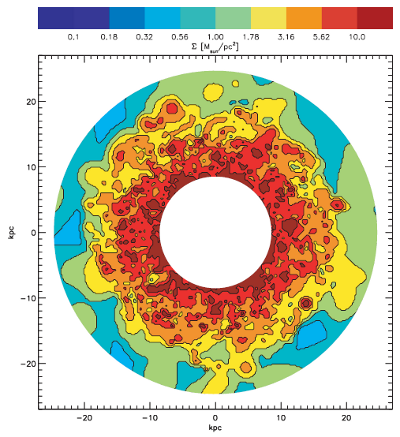
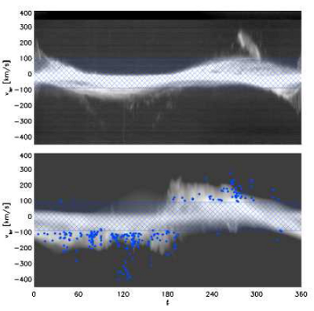

  

    <h4>Publications</h4>
    <a href="publications"><i class="fa fa-align-left fa-5x"></i></a>
  

  

    <h4>Ph. D Thesis</h4>
    <a href="thesis"><i class="fa fa-book fa-5x"></i></a>
  

  

    <h4>Visualizations</h4>
    <a href="visualizations"><i class="fa fa-video-camera fa-5x"></i></a>
  

  

    <h4>Talks</h4>
    <a href="talks"><i class="fa fa-volume-up fa-5x"></i></a>
  

The local Universe contains a huge diversity of galaxies, from the giant 'dead' elliptical galaxies that are no longer forming stars, to beautiful spiral galaxies much like our own Milky Way. What physics shapes these galaxies?

The basic picture is very simple. Small density fluctuations in the dark matter distribution in the early Universe are able to grow through their own self gravity, pulling in surrounding gas. This gas cools and settles into a disk, where it is able to form stars. Galaxies can then continue to grow via mergers with other galaxies and by continued accretion of more gas.

This simple model, however, cannot reproduce the huge variety of galaxies that we see in the local Universe. With nothing to stop gas from being accreted into galaxies and forming stars, all galaxies become massive and are always forming stars. The need for 'feedback' processes by which galaxies can regulate their own growth has become apparent. The interplay between these feedback processes and the fueling of galaxies is a hugely intertwined problem in which each physical process interacts with the others in a complex network of positive and negative feedback loops. The complex nature of these systems makes computational modelling of the galaxy formation process both difficult and scientifically rewarding.

<figure class="half">
  
  
  
  

<figcaption>
  From top-left to bottom-right:  
  Booth C. M., Schaye J., 2010, MNRAS, 405, L1: An illustration of the relationship between supermassive black holes and dark matter haloes  
  Booth C. M., Schaye J., Delgado J. D., Dalla Vecchia C., 2012, MNRAS, 420, 1053 A demonstration that we require small galaxies to pollute the intergalactic-medium with heavy elements  
  Booth C. M., Theuns T., Okamoto T., 2007, MNRAS, 376, 1588: The distribution of molecular hydrogen in a simulation of the Milky Way  
  Booth C. M., Theuns T., 2007, MNRAS 381, L89: The 'galactic fountain' observed in a simulated galaxy compared to that in our own galaxy
</figcaption>
</figure>
