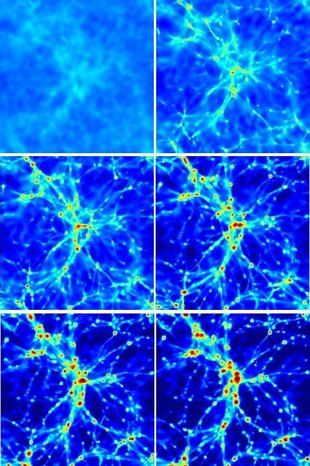

## Old AMR Simulations

  

    
  

  

    During my PhD I worked, amongst other things, on running structure formation simulations with the adaptive mesh refinement code FLASH. This is one movie that arose from this project, and shows the formation of a galaxy group down to redshift 1.2. The colours represent the gas density in the box averaged along the line of sight. From top left to bottom right the redshifts of the simulation outputs are 16, 6, 3.5, 2.4, 1.7, 1.2.

  

## The Density-Temperature Plane

## The Mass Distribution

<!--
[one_half last]
[heading]The density-temperature plane[/heading]

[caption id="attachment_679" align="alignleft" width="300"] High time-resolution movie of the evolution of gas and metals in the density-temperature plane[/caption]

This movie shows, for the OWLS 100Mpc/h box, the distribution of all gas particles (left panel) and of the heavy elements (right panel) in density-temperature space as a function of redshift.  The high time-resolution in this movie was made possible by an adaptive temporal output scheme.  The straight lines to the right of the panels represent gas that is star forming.

M <a href="http://www.craigmbooth.com/wp-content/uploads/2013/02/rhot.avi">Download Movie</a>

[/one_half]

[/full]

[full]

[one_fourth first]
&nbsp;
[/one_fourth]

[one_half]
[heading]The Mass Distribution[/heading]

[caption id="attachment_680" align="alignleft" width="240"] Pie chart showing how matter flows from one phase to another as the Universe evolves[/caption]

This animated pie chart shows, for the OWLS 100Mpc/h box with the REF physics implementation (see Schaye et al. 2010), the fraction of the gas in the Universe that exists in different phases as a function of cosmic time, from redshift 6 all the way down to redshift zero. The gas has been split into five phases, using fairly standard cuts in density and temperature.  The phases are defined as follows:
<ul class="child-pages">
  <li>Interstellar medium (ISM): Dense, star-forming gas inside of galaxies</li>
  <li>Stars</li>
  <li>Intergalactic medium (IGM): Cold (T<105K), underdense gas between galaxies</li>
  <li>Warm-hot intergalactic medium (WHIM): Warm-hot (105K-107K) gas shock heated by structure formation</li>
  <li>Intracluster medium (ICM): Hot (T>107K) gas in the haloes of the most massive galaxy clusters</li>
</ul>

M <a href="http://www.craigmbooth.com/wp-content/uploads/2013/02/mass_distribution.avi">Download Movie</a>

[/one_half]

[one_fourth last]
&nbsp;
[/one_fourth]
[/full]
)

-->
