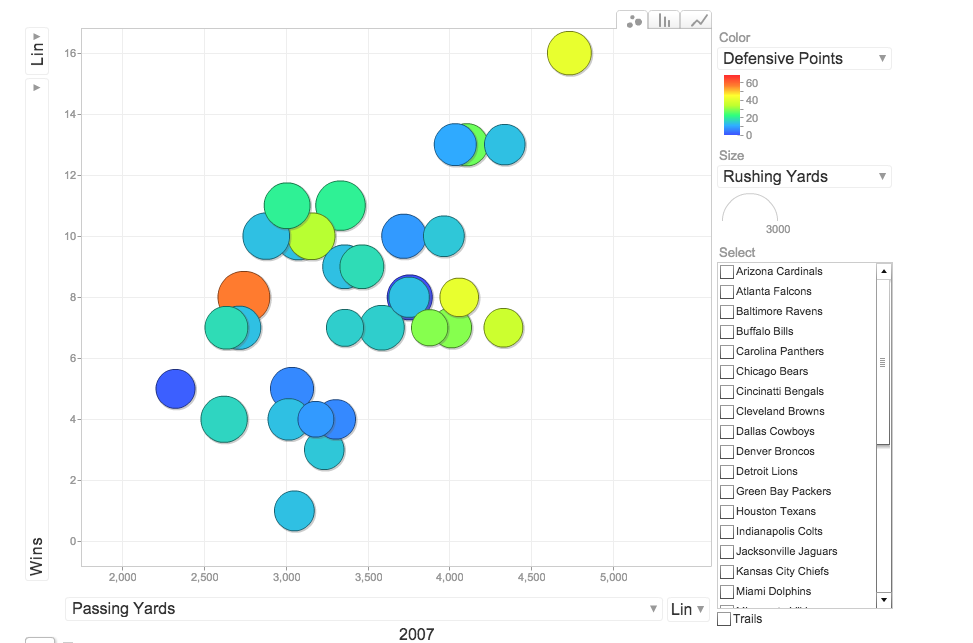
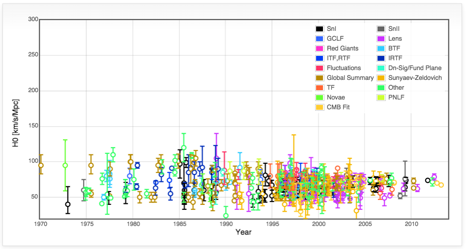
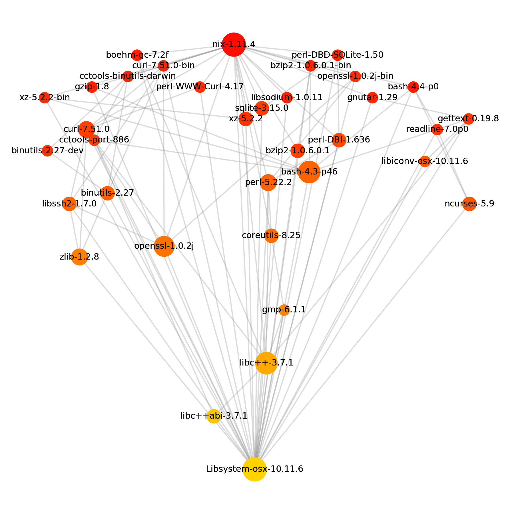

This page contains links to a bunch of cool projects I've built, largely related to data analysis and visualization.  I hope you like them!

  

    
  

  

    <h4>NFL Statsalyzer</h4>
    
I combined tables of NFL data with Google's chart API to produce a Gapminder style interactive visualization of how every team in the NFL has performed since the year 2000.

  

  

    <h4>Map of Software</h4>
    
I used a web spider to crawl stack overflow for every tagged question. I then used this data to construct a huge graph showing how all of the different tags are related. In essence forming a topographical map of how all of computing is interrelated. I then put this map into a zoomable, Google maps style interface.

  

  

    
  

  

    
  

  

    <h4>Measurement of the Hubble Parameter</h4>
    
I did a literature survey of measurements of the Hubble constant (the number that describes how fast the Universe id expanding) and plotted the results on an interactive graph to show how our inderstanding of the Universe has evolved.

  

  

    <h4>Nix Dependency Visualizer</h4>
    
I wrote a tool for software developers who use the <a href="https://nixos.org/nix">Nix</a> package manager, <i>nix-visualize</i>.  This tool looks at your software and draws a tree of its dependencies, your dependencies dependencies, your dependencies dependencies dependencies, and so on, all the way down to the operating system.

  

  

    
  

<--

  

    
  

  

    <h4>The Height and Weight of Every NFL Player, Visualized</h4>
    
I used a web spider to crawl stack overflow for every tagged question. I then used this data to construct a huge graph showing how all of the different tags are related. In essence forming a topographical map of how all of computing is interrelated. I then put this map into a zoomable, Google maps style interface.

  

  

    <h4>Household Infrared Photography</h4>
    
I used a web spider to crawl stack overflow for every tagged question. I then used this data to construct a huge graph showing how all of the different tags are related. In essence forming a topographical map of how all of computing is interrelated. I then put this map into a zoomable, Google maps style interface.

  

  

    
  

-->
